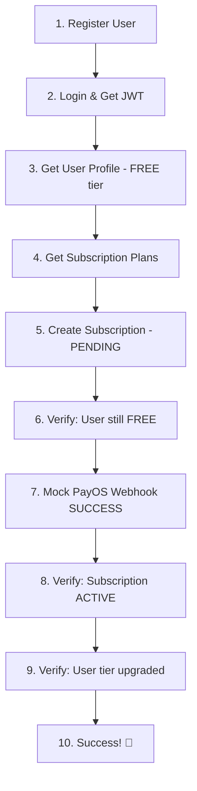

# 📦 Postman Collection - Subscription Payment Flow

## 🎯 Tổng quan
Collection Postman hoàn chỉnh để test quy trình thanh toán subscription, đảm bảo **user phải thanh toán thành công mới được đăng ký subscription**.

## 📁 Files được tạo

| File | Mô tả |
|------|-------|
| `NeuraPix-Subscription-Payment-Flow.postman_collection.json` | **Collection chính** - Chứa tất cả requests để test |
| `NeuraPix-Environment.postman_environment.json` | **Environment** - Variables và config |
| `README.md` | **Hướng dẫn chi tiết** - Setup và usage |
| `Quick-Start-Guide.md` | **Hướng dẫn nhanh** - 5 phút setup và chạy |
| `Test-Scenarios.md` | **Test cases chi tiết** - 10 scenarios đầy đủ |

## 🔄 Test Flow Overview



## ✅ Điều kiện test PASS

| Bước | Kiểm tra | Status |
|------|----------|---------|
| Initial | User có tier `FREE` | ✅ |
| After Create | Subscription status `PENDING` | ✅ |
| Before Payment | User vẫn `FREE` (không upgrade) | ✅ |
| After Payment | Subscription status `ACTIVE` | ✅ |
| Final | User tier upgraded thành `BASIC/PREMIUM` | ✅ |

## 🚀 Cách sử dụng nhanh

### 1. Import & Setup (1 phút)
```bash
1. Import collection file vào Postman
2. Import environment file  
3. Set environment = "NeuraPix Environment"
4. Đảm bảo backend đang chạy: http://localhost:8080
```

### 2. Run Tests (30 giây)
```bash
1. Click "Run" trên collection
2. Select all requests
3. Click "Run Collection"  
4. Xem kết quả! 🎯
```

## 🔍 Kết quả mong đợi

### ✅ Success Indicators:
- **All requests return 200 OK** (trừ test duplicate subscription)
- **User starts FREE → ends BASIC/PREMIUM**  
- **Subscription starts PENDING → ends ACTIVE**
- **Security enforced**: Không upgrade trước khi payment

### 📊 Test Coverage:
- ✅ **Authentication flow**
- ✅ **Subscription creation** 
- ✅ **Payment simulation**
- ✅ **Status verification**
- ✅ **Security validation**
- ✅ **Error scenarios**

## 🎯 Business Value

### Trước khi fix:
- ❌ User có thể dùng premium features mà chưa thanh toán
- ❌ Subscription active ngay lập tức
- ❌ Risk: Revenue loss và security issues

### Sau khi fix:
- ✅ User PHẢI thanh toán trước khi dùng premium features
- ✅ Subscription chỉ active sau payment success
- ✅ Secure và tuân thủ business logic

## 📞 Support

| Cần hỗ trợ | File tham khảo |
|------------|----------------|
| Setup nhanh | `Quick-Start-Guide.md` |
| Hướng dẫn chi tiết | `README.md` |
| Test cases cụ thể | `Test-Scenarios.md` |
| Troubleshooting | `README.md` → Section 🐛 |

## 🏆 Ready to Test!

**Mọi thứ đã sẵn sàng để test subscription payment flow một cách comprehensive và professional! 🚀**